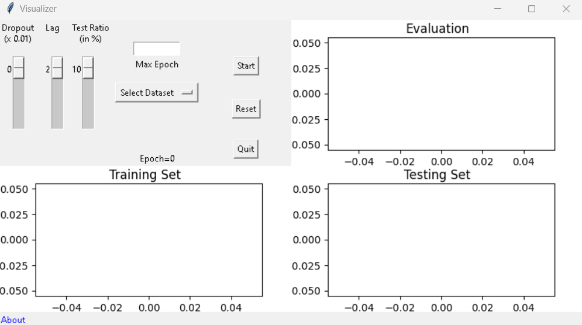
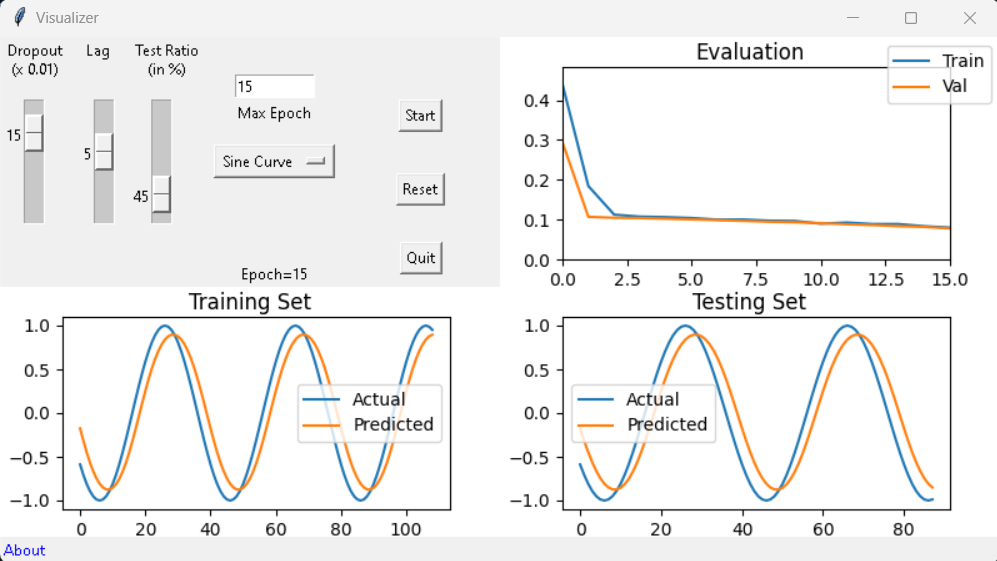
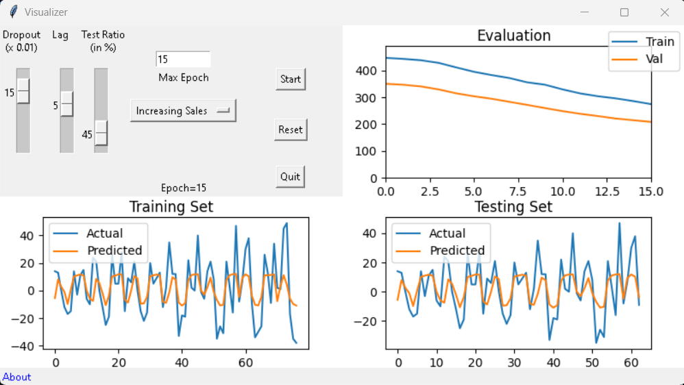
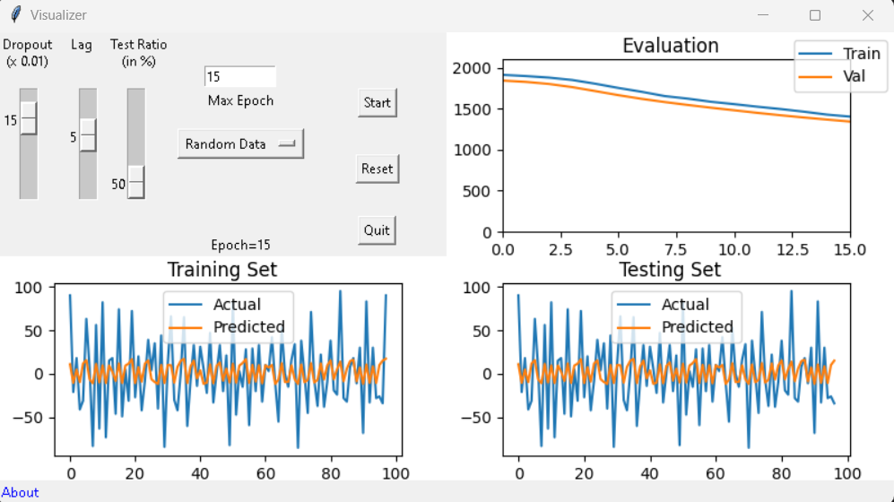

# Backpropagation Through Time in LSTM Visualizer

The project provides visualization for the LSTM model. There are five input components in this project, the detail of every component has been discussed below:

### Dropout Rate
The dropout slider let you chose the % percentage for the dropout rate.

### Lag in (m/s)
The Lag slider lets you add delay for the visualization by default it is set to two milliseconds.

### Test Ratio
The test ratio, or test split, refers to the proportion of the dataset that is reserved for testing the performance of a machine learning model.

### Max Epoch
The maximum number of epochs for the training of the model.
 
### Preloaded Datasets
Currently, the application supports 5 different datasets.

- Sine Wave
- Cosine Wave
- Increasing Sales
- Decreasing Sales
- Random Data

### Snapshots

  
  
  
  

